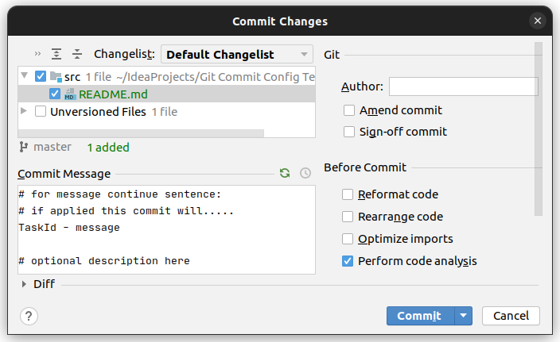

#  Git Config Commit Template

This Intellij Plugin enables it to use git config commit.template parameter by default.

## Features

* **Loads commit template** from `git config commit.template` to commit message field.

    create template `/messageTemplate`
    ```
    TaskId - message
       
    description    
    ```
    setting template for git repo
    ```
    git config commit.template /messageTemplate
    ```
    And now in IntelliJ commit dialog
    
    
    
* **Supports Comments** - Your template can have comment lines, on commit those will be deleted

    Template
    ```
    # for message continue sentence: 
    # if applied this commit will.....
    TaskId - message
    
    # optional description here 
    ```
  
    Commit dialog
    
    
    
    After commit
    
    
    

## Good for Open Source Support

Easy way to use GitHub features:
* [Creating a commit with multiple authors](https://docs.github.com/en/github/committing-changes-to-your-project/creating-a-commit-with-multiple-authors)
* [Creating a commit on behalf of an organization](https://docs.github.com/en/github/committing-changes-to-your-project/creating-a-commit-on-behalf-of-an-organization)

Because You can create a template with your whole team for example:
```
<this line could be empty: place for commit message>


# Co-authored-by: @member1 <name1.surname@company.com>
# Co-authored-by: @member2 <name2.surname@company.com>
# Co-authored-by: @member3 <name3.surname@company.com>
# Co-authored-by: @member4 <name4.surname@company.com>
on-behalf-of: @Company <name.surname@company.com>
```

And then in case you are mob programming you just uncomment your teammates.

In case you ar participating on work time - no need to worry to add on-behalf-of tag.

Then all participants would get share of involvement represented

